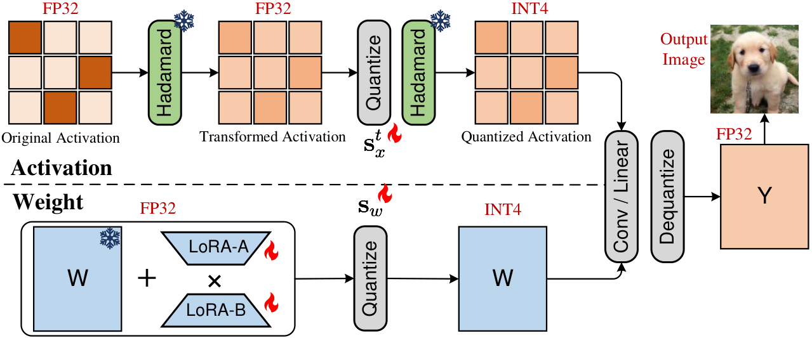

# HQ-DM: Single Hadamard Transformation-Based Quantization-Aware Training for Low-Bit Diffusion Models

[](https://arxiv.org/abs/2512.05746)
[](https://arxiv.org/abs/2512.05746)

## About

This repository contains the implementation associated with our ECCV 2026 paper:

> **HQ-DM: Single Hadamard Transformation-Based Quantization-Aware Training for Low-Bit Diffusion Models**

Diffusion models are expensive to deploy because their iterative denoising process requires substantial computation and memory. HQ-DM investigates low-bit quantization-aware training for diffusion models, with a focus on reducing activation outliers while preserving generation quality.

## What is HQ-DM?

HQ-DM combines:

- **Single Hadamard Transformation** before activation quantization to diffuse large activation values and make them more suitable for low-bit representation.
- **Quantization-aware training** for both activations and weights.
- **LoRA-based distillation/fine-tuning** so that the pretrained model can remain largely frozen while adapting to quantization noise.
- **Timestep-aware learnable quantization factors** to address the changing activation distributions throughout the diffusion denoising process.
- A hardware-friendly path for quantized linear and convolution operations, including integer-compatible computation.

Compared with Double Hadamard Transformation schemes, the proposed Single Hadamard Transformation avoids offline transformation of the weights, supports convolution operations more naturally, and reduces the risk of amplifying weight outliers.

## Framework



The framework transforms activations before quantization, quantizes the adapted weights, and performs the denoising computation with quantized linear/convolution operators before dequantization and image reconstruction.

## Repository Status

The code is being organized and will be released soon. More details, including the complete code and usage instructions, will be added in a future update.

## BibTeX

```bibtex
@inproceedings{mao2026hqdim,
  title     = {HQ-DM: Single Hadamard Transformation-Based Quantization-Aware Training for Low-Bit Diffusion Models},
  author    = {Mao, Shizhuo and Zou, Hongtao and Xie, Qihu and Chen, Song and Kang, Yi},
  booktitle = {European Conference on Computer Vision (ECCV)},
  year      = {2026}
}
```
